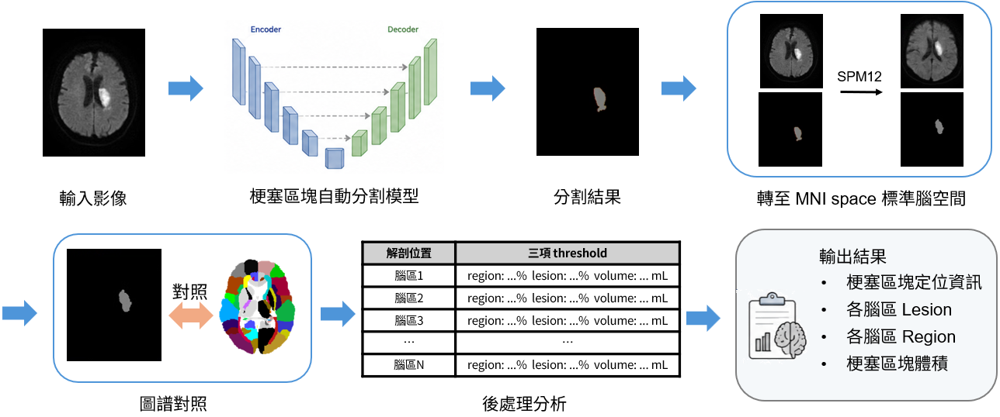

# 基於三維nnU-Net之擴散權重影像缺血性腦中風病灶自動定位與定量分析流程

作者: Cheng-Han Lee (李承翰) Sheng-Feng Sung (宋昇峯) Syu-Jyun Peng (彭徐鈞)

此為我的專題的原型版，利用MATLAB來實現整個缺血性腦中風梗塞定位定量分析流程

## 簡介


輸入DWI影像經腦梗塞自動分割模型取得病灶分割結果後，
利用SPM12將DWI與分割結果轉換至MNI標準腦空間，並與腦區圖譜進行對照，以取得病灶所涉及之解剖腦區。
隨後依各腦區之病灶分布比例（Region）、腦區受累比例（Lesion）及受累體積（Volume）進行後處理與定量分析，
最終輸出梗塞區塊定位資訊、各腦區受累程度及梗塞體積

## 環境需求
```
本專案需要以下軟體與環境：

- Python / Conda 環境：請參考 `environment.yml`
- MATLAB R2026a
- SPM12

在執行 MATLAB 相關程式前，需先安裝 SPM12，並將 SPM12 加入 MATLAB 路徑中。

本專案開發時使用的 SPM12 安裝路徑為：C:\Program Files\MATLAB\R2026a\toolbox\spm12

請準備好JHU_MNI_SS_WMPM_Type-II.nii圖譜
```

## 請記得改專案的各個路徑名稱
```
% python路徑
pyenv("Version", "anaconda的python路徑");

% predict 路徑
exe = "nnUNetv2_predict.exe的路徑";

% 模型路徑
setenv("nnUNet_raw", "nnUNet_raw資料夾的路徑");
setenv("nnUNet_preprocessed", "nnUNet_preprocessed資料夾的路徑");
setenv("nnUNet_results", "nnUNet_results資料夾的路徑");
% setenv("CUDA_VISIBLE_DEVICES", "");

% SPM 程式路徑
segment = load('MNI_way\segment_job.mat的路徑');
normalize = load('MNI_way\normalize_job.mat的路徑');
atlas_file = 'JHU_MNI_SS_WMPM_Type-II.nii的路徑';
```

